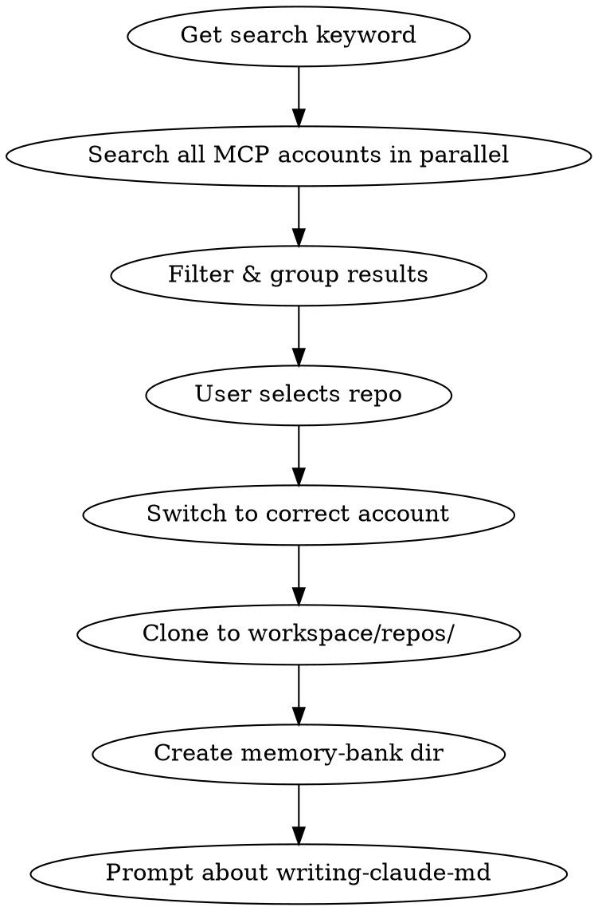

# Managing Workspace

Manage child project repositories in `workspace/repos/`.

## Operations

| Operation | Triggers | Action |
|-----------|----------|--------|
| **Add** | 添加、clone、add repo | Search → clone → create memory-bank |
| **Remove** | 删除、移除、remove | Delete repo → archive memory-bank |
| **Update** | 更新、pull、sync | git pull |
| **List** | 列出、查看、list | Show all repos status |

## Add Repo

### Flow



### Search Strategy

Search ALL MCP GitHub accounts in parallel:

```bash
# Parallel search
mcp__github-personal__search_repositories(query)
mcp__github-microsoft__search_repositories(query)
# ... other accounts
```

### Display Results

**Priority:** Private repos first, grouped by account.

```text
┌─ github-microsoft ─────────────────────┐
│ 1. infinity-microsoft/studio (private) │
│ 2. infinity-microsoft/docs (private)   │
└────────────────────────────────────────┘
┌─ github-personal ──────────────────────┐
│ 3. mao-family/project-x (private)      │
└────────────────────────────────────────┘
```

Filter out unrelated public repos (e.g., searching "studio" should not show microsoft/vscode).

### Clone

```bash
# Switch to correct account
gh auth switch --user <account>

# Clone
cd workspace/repos
gh repo clone <owner>/<repo>

# Create memory-bank
mkdir -p ../memory-bank/<repo>/
```

### Completion Message

```text
✅ 已添加 <repo> 到 workspace
📁 已创建 workspace/memory-bank/<repo>/
💡 可使用 writing-claude-md skill 生成项目 CLAUDE.md
```

## Remove Repo

### Flow

1. Verify `workspace/repos/{project}/` exists
2. Delete repo directory
3. Archive memory-bank (NOT delete):
   - Move `workspace/memory-bank/{project}/` to `workspace/memory-bank/archived/{project}/`

### Commands

```bash
rm -rf workspace/repos/<project>
mkdir -p workspace/memory-bank/archived
mv workspace/memory-bank/<project> workspace/memory-bank/archived/
```

### Completion Message

```text
✅ 已删除 <project>
📦 已归档 workspace/memory-bank/archived/<project>/
```

## Update Repo

### Single Repo

```bash
cd workspace/repos/<project>
git pull
```

### All Repos

```bash
for repo in workspace/repos/*/; do
  echo "Updating $(basename $repo)..."
  (cd "$repo" && git pull)
done
```

## List Repos

### Output Format

```text
workspace/repos/
├── studio
│   ├── 分支: main
│   ├── 状态: clean
│   └── memory-bank: ✓
├── another-project
│   ├── 分支: feature/new-feature
│   ├── 状态: 3 uncommitted changes
│   └── memory-bank: ✗
```

Show for each repo:

- Name
- Current branch
- Uncommitted changes count
- Whether memory-bank exists

## Switch Workspace

> **TODO:** Needs solution for context path resolution.
>
> Problem: After switching, may read wrong CLAUDE.md path.
> Need "current workspace" concept to ensure correct memory-bank paths.

## Directory Structure

```text
workspace/
├── repos/
│   ├── studio/
│   └── another-project/
└── memory-bank/
    ├── studio/
    │   └── CLAUDE.md
    ├── another-project/
    └── archived/
        └── deleted-project/
```
